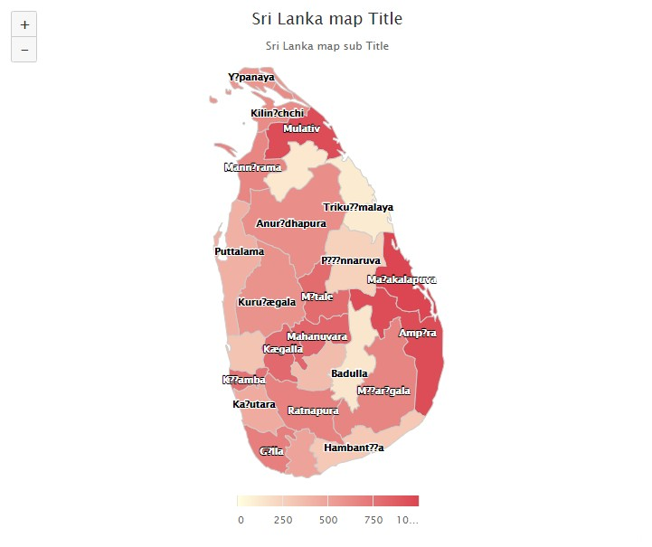

# Highcharts Map - Sri Lanka



### Using this project I integrated `Highcharts Map`. Initially those values are hardcoded and in 5sec. timer data change in _Observable_.

run below angular command to import `Highcharts` and `Highcharts Map`

```
npm install highcharts-angular --save
npm install highcharts --save
npm install @highcharts/map-collection --save
```

import `HighchartsChartModule` module in **_app.module.ts file_**

``` javascript
...
import {HighchartsChartModule} from 'highcharts-angular';

@NgModule({
  imports: [
    ...
    HighchartsChartModule
```
at the moment map's name loaded from library json file. if you want to change district name you can change external _lk-all.geo.json_ file in assets folder.

``` javascript
...
import sriLanka from '@highcharts/map-collection/countries/lk/lk-all.geo.json';
// import sriLanka from '../../assets/lk-all.geo.json';
```

* lk-bc = Batticaloa
* lk-mb = Mannar
* lk-ja = Jaffna
* lk-kl = Kilinochchi
* lk-ky = Kandy
* lk-mt = Matale
* lk-nw = Nuwara Eliya
* lk-ap = Ampara
* lk-pr = Polonnaruwa
* lk-tc = Trincomalee
* lk-ad = Anuradhapura
* lk-va = Vavuniya
* lk-mp = Mulativu
* lk-kg = Kurunegala
* lk-px = Puttalam
* lk-rn = Ratnapura
* lk-gl = Galle
* lk-hb = Hambantota
* lk-mh = Matara
* lk-bd = Badulla
* lk-mj = Monaragala
* lk-ke = Kegalla
* lk-co = Colombo
* lk-gq = Gampaha
* lk-kt = Kalutara
